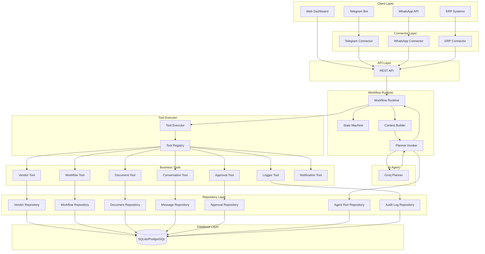
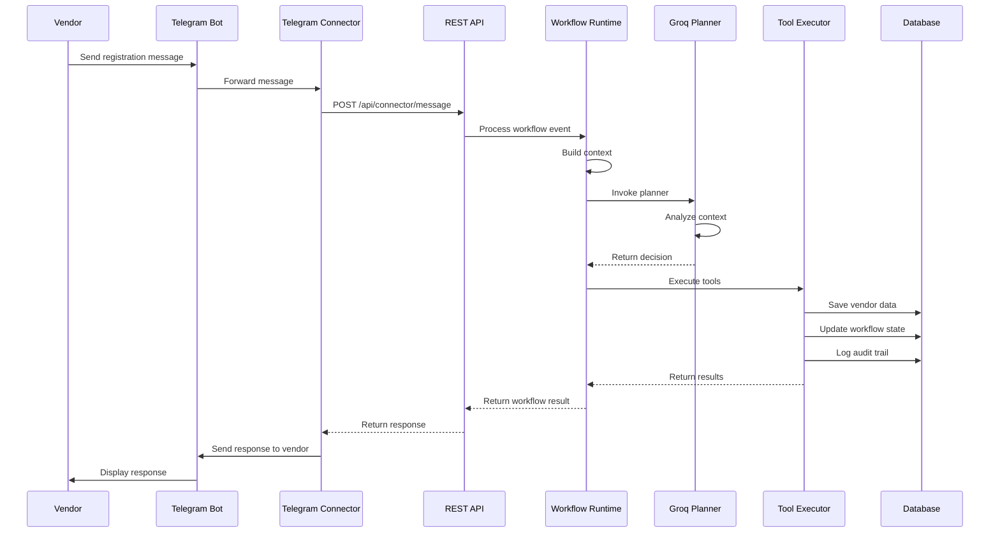
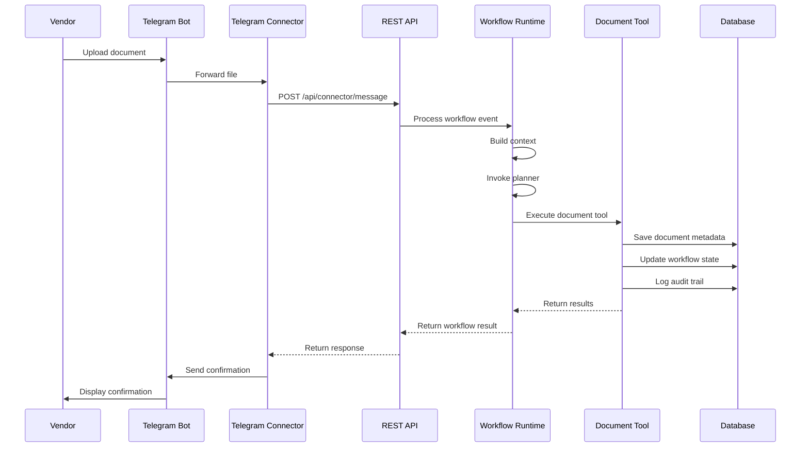
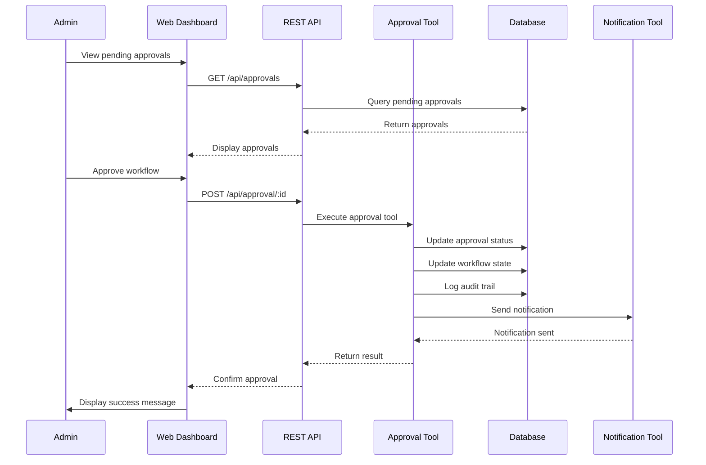
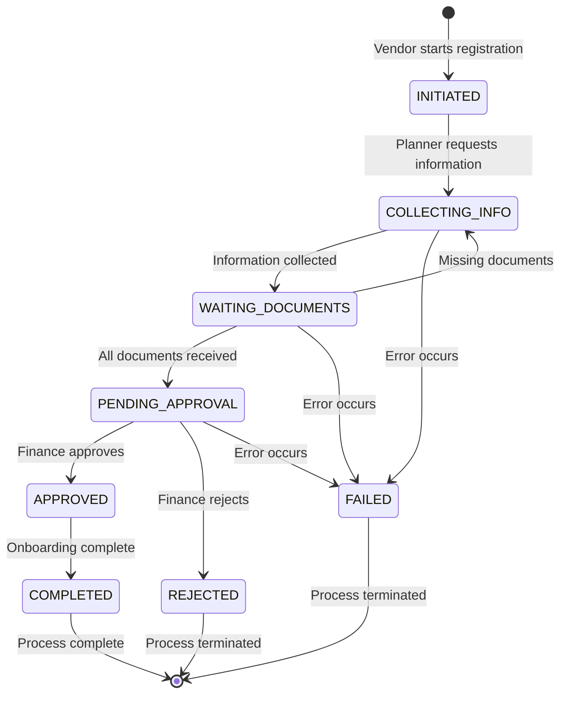

# System Architecture

## Overview

The Vendor Onboarding AI Agent is a sophisticated multi-layer system that automates vendor registration through AI-powered conversation management, document processing, and workflow orchestration.

## High-Level Architecture



## Component Details

### 1. Client Layer

**Purpose**: External systems and users interacting with the vendor onboarding system.

**Components**:
- **Telegram Bot**: Production-ready bot for vendor communication
- **WhatsApp API**: Ready for integration (architecture supports)
- **ERP Systems**: Mock connector for testing system integrations
- **Web Dashboard**: Next.js 16 admin interface for monitoring and management

### 2. Connector Layer

**Purpose**: Normalizes external communication channels into a unified format.

**Key Features**:
- Message normalization (converts platform-specific formats to standard)
- Retry logic with exponential backoff
- Health monitoring and metrics
- Transport abstraction
- Security and validation

**Components**:
- **Telegram Connector**: Handles Telegram Bot API integration
- **WhatsApp Connector**: Placeholder for WhatsApp Business API
- **ERP Connector**: Mock connector for ERP system integration

### 3. API Layer

**Purpose**: HTTP REST API for system communication.

**Technology**: Express.js with TypeScript

**Key Endpoints**:
- `POST /api/connector/message` - Receives messages from connectors
- `POST /api/workflow/process` - Triggers workflow processing
- `GET /api/workflow/:id` - Retrieves workflow details
- `GET /api/vendor/:id` - Retrieves vendor information
- `GET /api/timeline/:id` - Retrieves workflow timeline
- `POST /api/approval/:id` - Submits approval decisions

### 4. Workflow Runtime

**Purpose**: Orchestrates the complete workflow execution lifecycle.

**Components**:
- **Context Builder**: Assembles context for planner (vendor, workflow, documents, conversation)
- **Planner Invoker**: Manages AI planner invocation with error handling
- **State Machine**: Validates and enforces state transitions
- **Workflow Dispatcher**: Creates execution plans from planner decisions

**Flow**:
1. Accept WorkflowEvent
2. Build execution context
3. Invoke AI planner
4. Validate planner response
5. Validate state transition
6. Dispatch execution plan
7. Execute tools via Tool Executor

### 5. AI Agent (Planner)

**Purpose**: Decision-making brain using Groq LLM.

**Technology**: Groq SDK with Llama 3.1 models

**Responsibilities**:
- Analyzes conversation context
- Decides next actions
- Selects appropriate tools
- Generates responses
- Plans workflow progression

**Key Constraint**: The Planner NEVER executes tools directly - it only decides what should happen.

### 6. Tool Executor

**Purpose**: Executes business tools as directed by the planner.

**Components**:
- **Tool Registry**: Manages available tools
- **Tool Executor**: Orchestrates tool execution with error handling

**Features**:
- Sequential tool execution
- Error handling and rollback
- Result aggregation
- Performance tracking

### 7. Business Tools

**Purpose**: Implement business logic for vendor onboarding.

**Tools**:
- **Vendor Tool**: Vendor CRUD operations
- **Workflow Tool**: State management and transitions
- **Document Tool**: Document upload and verification
- **Conversation Tool**: Message history management
- **Approval Tool**: Approval workflow management
- **Logger Tool**: Event logging and audit trails
- **Notification Tool**: Sending notifications

### 8. Repository Layer

**Purpose**: Data access layer with zero business logic.

**Repositories**:
- **Vendor Repository**: Vendor data access
- **Workflow Repository**: Workflow state management
- **Document Repository**: Document metadata
- **Message Repository**: Conversation history
- **Approval Repository**: Approval requests
- **Agent Run Repository**: AI planner invocation tracking
- **Audit Log Repository**: Complete audit trail

**Design Pattern**: Repository pattern with async/await

### 9. Database Layer

**Purpose**: Persistent data storage.

**Technology**: Prisma ORM with SQLite (development) / PostgreSQL (production)

**Schema**:
- **Vendor**: Company information
- **Workflow**: Onboarding workflow state
- **Message**: Conversation history
- **Document**: Uploaded documents
- **Approval**: Finance approval requests
- **AgentRun**: Planner invocation tracking
- **AuditLog**: Complete audit trail

## Data Flow

### Vendor Registration Flow



### Document Upload Flow



### Approval Flow



## State Machine

### Workflow States



### State Transitions

| From State | To State | Trigger |
|------------|----------|---------|
| INITIATED | COLLECTING_INFO | Vendor sends first message |
| COLLECTING_INFO | WAITING_DOCUMENTS | All required info collected |
| WAITING_DOCUMENTS | COLLECTING_INFO | Missing documents detected |
| WAITING_DOCUMENTS | PENDING_APPROVAL | All documents verified |
| PENDING_APPROVAL | APPROVED | Finance approval granted |
| PENDING_APPROVAL | REJECTED | Finance approval denied |
| APPROVED | COMPLETED | Final processing complete |
| Any | FAILED | Critical error occurs |

## Technology Stack

### Backend
- **Runtime**: Node.js 18+
- **Framework**: Express.js 5.2.1
- **Language**: JavaScript (CommonJS)
- **Database**: SQLite (dev) / PostgreSQL (prod)
- **ORM**: Prisma 5.22.0
- **AI**: Groq SDK with Llama 3.1
- **Validation**: Zod 4.4.3
- **HTTP Client**: Axios 1.18.1

### Frontend
- **Framework**: Next.js 16.2.10 (App Router)
- **UI Library**: React 19.2.4
- **Language**: TypeScript 5
- **Styling**: TailwindCSS 4
- **Icons**: Lucide React
- **HTTP Client**: Axios 1.18.1

### Connectors
- **Telegram**: node-telegram-bot-api 1.1.2
- **WhatsApp**: Ready for integration
- **ERP**: Mock connector

## Security Architecture

### Authentication & Authorization
- API key-based authentication for connectors
- Environment variable-based secrets management
- CORS configuration for cross-origin requests
- Input validation using Zod schemas

### Data Security
- Environment variables for sensitive data
- Database connection encryption (PostgreSQL)
- File upload validation
- SQL injection prevention (Prisma ORM)

### Audit Trail
- Complete audit logging for all state transitions
- Agent run tracking for AI decisions
- Message history for compliance
- Document verification logs

## Deployment Architecture

### Development
```
┌─────────────────────────────────┐
│  Developer Machine              │
│  ├── Backend (localhost:5000)  │
│  ├── Frontend (localhost:3000) │
│  ├── SQLite Database           │
│  └── Connectors (local)        │
└─────────────────────────────────┘
```

### Production
```
┌─────────────────────────────────┐
│  Load Balancer                  │
└────────────┬────────────────────┘
             │
    ┌────────┴────────┐
    │                 │
┌───▼────┐      ┌────▼───┐
│ Backend│      │Backend │
│ Instance│      │Instance│
└───┬────┘      └────┬───┘
    │                │
    └────────┬───────┘
             │
    ┌────────▼────────┐
    │ PostgreSQL DB   │
    │ (Primary)       │
    └────────┬────────┘
             │
    ┌────────▼────────┐
    │ PostgreSQL DB   │
    │ (Replica)       │
    └─────────────────┘
```

## Scalability Considerations

### Horizontal Scaling
- Stateless design enables easy backend scaling
- Connector instances can be scaled independently
- Database connection pooling for high concurrency
- Load balancer support for API layer

### Performance Optimization
- Database indexing on frequently queried fields
- JSON field optimization for metadata
- Connection pooling for database
- Caching strategy for frequently accessed data
- Async/await for non-blocking operations

### Monitoring & Observability
- Structured JSON logging
- Health check endpoints
- Connector metrics reporting
- Agent run performance tracking
- Audit trail for debugging

## Key Design Principles

1. **Complete Decoupling**: Each layer communicates only through defined interfaces
2. **HTTP-Only Integration**: Connectors communicate exclusively via REST API
3. **No Business Logic Pollution**: Controllers and connectors contain zero business logic
4. **Comprehensive Audit Trail**: Every action tracked for compliance and debugging
5. **Horizontal Scalability**: Stateless design enables easy scaling
6. **Security by Design**: Input validation, authentication, and secure communication

## Future Enhancements

### Phase 7 (Next)
- WhatsApp connector implementation
- Real ERP system integration
- Email notification service
- SMS notification service

### Phase 8 (Future)
- Multi-language support
- Advanced analytics dashboard
- Workflow templates
- Custom approval flows
- Bulk operations
- Real-time WebSocket updates
